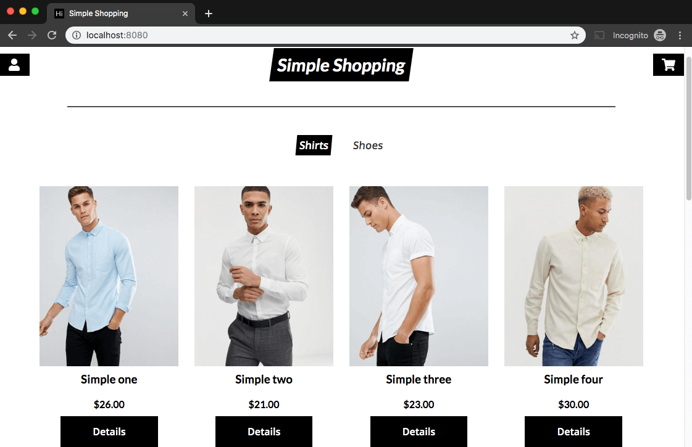

# Simple Shopping

Simple shopping is a simple e-commerce shopping interface. I built this application in order to gain familiarity with Redux and how global state objects operate within React.

There is much more functionality I could hook up to this application, but I primarily just wanted to build a simple interface that allowed me to play with a global state object.

